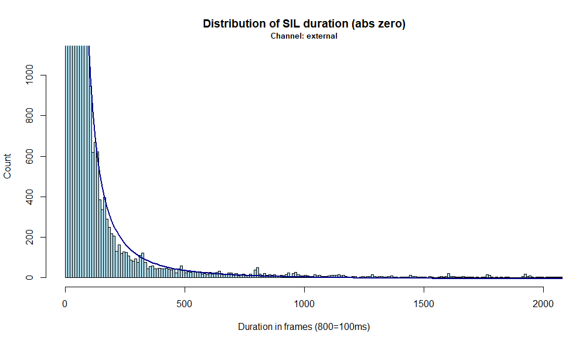

# Call Quality Metrics
Providing tools to access call quality - with special focus of phone calls. 


# Analysis
## Basic stats

```
received   104  calls  
received   312  files (in, out, n/a)  
empty       10  (zero audio duration)
-------------------------------
received    94  calls (no-empty)
            63  inbound calls 
            31  outgoing calls
-------------------------------
total dur    4  hours (4:02:37.64)
```

### Call duration 
* total 4 hours (4:02:37.64)
* distribution (omitting 10 empty calls)


### File naming 
* each call has 3 recordings 
  * suffix `-in` : customer channel (mono)
  * suffix `-out`: agent channel (mono)
  * no suffix : mixed channel (mono)
``` 
6767404 Aug 29 10:49 20250829-104221-99000000230000000873-GOUT00000023901-in.wav
6767404 Aug 29 10:49 20250829-104221-99000000230000000873-GOUT00000023901-out.wav
6767404 Aug 29 10:49 20250829-104221-99000000230000000873-GOUT00000023901.wav
```


* speaker can be calculated using 
  * `GIM/GOUT` tag in the file name 
  * `-in/-out` suffix in the filename 
``` 
20250829-104221-99000000230000000873-GOUT00000023901-out.wav
                                     ^^^             ^^^
                          call direction          suffix       
```
```
tag  -suff     speaker
----------------------
 GIM   -in   : customer/external 
 GIM  -out   : agent/store
GOUT   -in   : agent/store
GOUT  -out   : customer/external
----------------------
```


### Audio format 
  * 8kHz 16bit mono PCM
```
soxi
Input File     : '20250829-104221-99000000230000000873-GOUT00000023901{-in,-out,}.wav'
Channels       : 1
Sample Rate    : 8000
Precision      : 16-bit
Duration       : 00:07:02.96 = 3383680 samples ~ 31722 CDDA sectors
File Size      : 6.77M
Bit Rate       : 128k
Sample Encoding: 16-bit Signed Integer PCM
```

# Analysis

## Low quality regions
* higher frequency components are attenuated/reduced/flattened
* [better quality sample](doc/audio/good-quality-store.wav)
* [bad quality sample](doc/audio/bad-quality-store.wav)


## Silent gaps
* audio amplitude is zeroed all of a sudden 
  * white band in spectrogram
* happens both (a) during speech and (b) during silence
  * not due to misconfigured VAD or noise-/echo cancellation  


## Distribution of silence duration 
* SIL is normal 
  * crossing & hitting zero
  * VAD or noice cancellaion -> zero-ing out everything if there is no speech 
* SIL is not normal if it occurs within speech 
* distribution of SIL duration
### SIL in outbound channels
* zero-amplitude spans **outbound** channel
* recorded in-house => track recording device!
* remarkable peaks -> forced by package loss (package size == 20ms?)


### SIL in inbound channels
* zero-amplitude spans in **inbound** channel
* external source: other store or customer
* no peaks -> no/less packet drops
* smooth (power) distribution  


